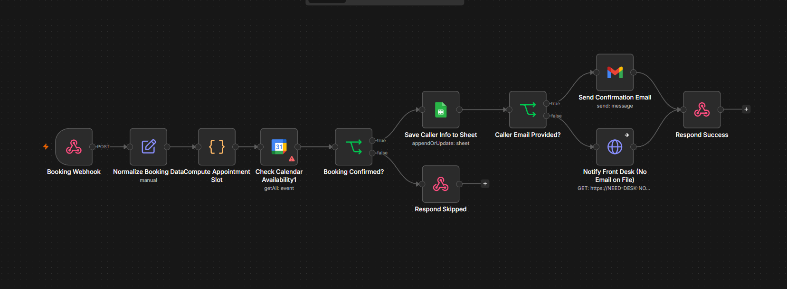

# 🦷 Dental AI Receptionist

An AI voice agent that answers a dental clinic's phone line, books a real appointment, and **checks the doctor's Google Calendar before confirming** — no double-bookings, no manual scheduling.


## How it works

**Retell AI** handles the phone conversation — greets the caller, understands intent, and collects booking details (name, service, preferred date/time). Once confirmed, it calls an **n8n** webhook that:
 
- Normalizes the raw call data
- Checks Google Calendar for real-time availability
- Logs the booking to Google Sheets (with call ID for traceability)
- Sends a Gmail confirmation email to the patient
- Notifies the front desk via webhook, with fallback handling so a notification hiccup never breaks a booking

---

## 🧠 Architecture

```
Caller
  │  (phone call)
  ▼
Retell AI (Conversation Flow)
  │  greets caller → collects intent, name, phone, service, date/time → confirms details
  │  POST webhook: caller_name, phone_number, service, preferred_date, preferred_time
  ▼
n8n Workflow (orchestration layer)
  │
  ├─ Booking Webhook            → receives the call payload
  ├─ Normalize Booking Data     → cleans/standardizes fields
  ├─ Compute Appointment Slot   → derives the requested start/end time
  ├─ Check Calendar Availability → queries Google Calendar for conflicts
  ├─ Booking Confirmed? (IF)
  │     ├─ true
  │     │    ├─ Save Caller Info to Sheet   → appends/updates Google Sheet
  │     │    ├─ Caller Email Provided? (IF)
  │     │    │     ├─ true  → Send Confirmation Email (Gmail)
  │     │    │     └─ false → Notify Front Desk (No Email on File)
  │     │    └─ Respond Success → response back to Retell
  │     └─ false
  │          └─ Respond Skipped → slot unavailable, response back to Retell
```



---

## 🛠️ Tech stack

| Layer | Tool | Role |
|---|---|---|
| Conversational AI | **Retell AI** | Handles the live phone call — speech-to-text, dialogue management, text-to-speech, and intent routing via a visual conversation flow |
| Orchestration | **n8n** | Receives the booking webhook and drives the entire post-call pipeline |
| Calendar | **Google Calendar** | Source of truth for doctor availability; checked before any booking is confirmed |
| Data logging | **Google Sheets** | Front-desk-facing record of every booking, with call ID for traceability |
| Notifications | **Gmail + Webhook** | Patient confirmation email + instant front-desk alert |

---

## 📁 Repo contents

| File | Description |
|---|---|
| `Dental_Retell.json` | Exported Retell AI agent — conversation flow |
| `N8N_Workflow.png` | Screenshot of n8n orchestration workflow |
| `Retell_Workflow.png` | Screenshot of Retell orchestration workflow |
| Demo video | End-to-end walkthrough of a live call: greeting → booking → calendar check → confirmation email |

---

## 🗣️ How the call flows (Retell conversation flow)

1. **Greeting & Intent Router** — "Thank you for calling QuensultingAI Dental Clinic. This is Riya. How can I help you today?"
2. **Answer FAQ** *(if it's a question)* — hours, services, fees, location, payment, walk-ins, emergencies — answered strictly from the clinic's approved info, never invented
3. **Collect Name & Phone** — captured and read back for confirmation (Optional - Can take **GMAIL** if option Enabled)
4. **Select Service** — Dental Cleaning, Root Canal, Teeth Whitening, Braces Consultation, Tooth Extraction, or General Consultation
5. **Select Date & Time** — enforces clinic hours (Mon–Sat, 9 AM–6 PM)
6. **Confirm Booking Details** — full summary read back before submission
7. **Book Appointment** *(function call)* — POSTs to the n8n webhook and waits for a result (Checks for the slot and updates)
8. **Booking Confirmed** or **Booking Failed** — depending on calendar availability, with a graceful fallback to the front desk if anything goes wrong

---

## 🚧 Status

This is a working, live system — a caller can genuinely book an appointment through it today. Still being refined:

- Better error recovery in the booking flow
- Richer conversation handling for edge cases
- More robust fallback paths when a downstream service (Calendar/Sheets/Gmail) is slow or unavailable
